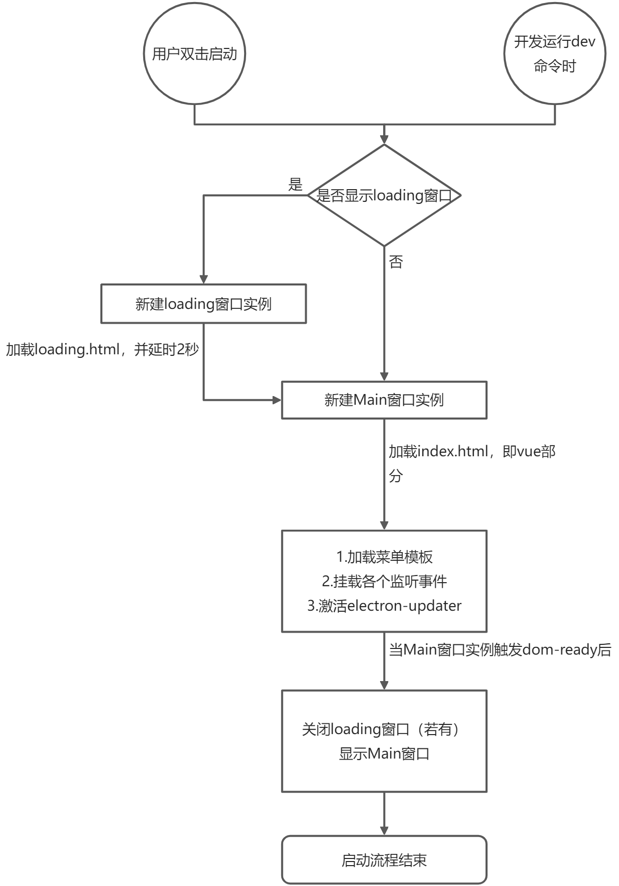

# Electron-Vue-template

## 介绍

### 这是什么？

- 这是一个基于 webpack5 和 vue2/3 的 electron 快速上手框架，你不需要关注它们是怎么联动的，你只需要关注你当前的界面组合就好
  剩下的交给我就好
- 上手极快，几乎没有任何心智负担对于前端而言，特别是当你熟悉 vue 和 js 时，就好像回家了一样

### 有什么功能？

1. 热更新模式，何为热更新模式，即在打包以后若有界面变更不需要用户重新下载整个应用就可以变更
2. 文件下载
3. 全量更新
4. 简单的 demo 示例，包含以上代码示例具体详见文档：[中文在线文档](https://umbrella22.github.io/electron-vue-template-doc/)，[国内访问地址](https://zh-sky.gitee.io/electron-vue-template-doc/)。

> **请注意，在 2021 年 4 月 13 日的更新之后，将使用 esbuild 替换 babel，如对 babel 有强需求的小伙伴请勿更新。**

- vite 版本 [electron-vite-template](https://github.com/umbrella22/electron-vite-template)

- [electron-vite-template（码云）](https://gitee.com/Zh-Sky/electron-vite-template)

- react 版 [Electron-react-template](https://github.com/umbrella22/electron-react-template)

<div align="center" >
  <span>测试打包状态：</span>
  <a href="https://github.com/umbrella22/electron-vue-template">
    
  </a>
</div>

> ### **请确保您的 node 环境是大于或等于 16**

#### 如何安装

```bash
npm config edit
# 该命令会打开npm的配置文件，请在空白处添加，此操作是配置淘宝镜像。
# registry=https://registry.npmmirror.com
# electron_mirror=https://cdn.npmmirror.com/binaries/electron/
# electron_builder_binaries_mirror=https://npmmirror.com/mirrors/electron-builder-binaries/
# 然后关闭该窗口，重启命令行.
# 使用yarn安装
yarn or yarn install

# 启动之后，会在9080端口监听
yarn dev

# build命令在不同系统环境中，需要的的不一样，需要自己根据自身环境进行配置
yarn build

```

---

## 启动逻辑图



# [更新日志](CHANGELOG.md)
